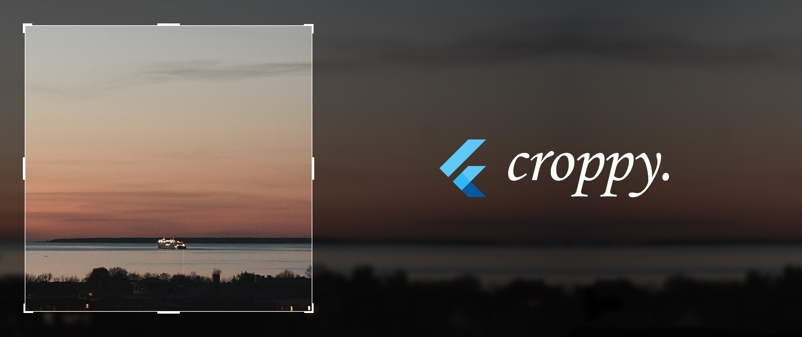

# croppy

[](https://pub.dev/packages/croppy)

A fully customizable image cropper for Flutter, with built-in Material and Cupertino croppers.

Check out the example at https://kekland.github.io/croppy.

<p float="left">
  
  
  
  
</p>

Supported platforms:
- Android 
- iOS
- Windows
- Linux (untested, but should work)
- macOS
- Web (uses Dart's Cassowary instead of FFI because there's no FFI support in web)

## Features

- Material image cropper (similar to Google Photos)
- iOS Photos app-like image cropper
- Support for any linear transformations on the image: scaling, rotating, skewing, flipping, etc
- Completely customizable (will create documentation with later releases)
- Fixed aspect ratios
- Custom cropping shapes
- Kickass animations
- Localization

In progress:

- Image editing module (?) (brightness, contrast, etc)

## Getting started

Install `croppy` from `pub`:

```yaml
dependencies:
  croppy: <latest_version>
```

Enjoy using it :)

## Usage

Currently `croppy` supports a Material (Google Photos-like) and a Cupertino (iOS Photos-like) image croppers:

```dart
final result = await showMaterialImageCropper(
  context,
  imageProvider: const NetworkImage('MY_IMAGE_URL'), // Or any other image provider
);

final result = await showCupertinoImageCropper(
  context,
  imageProvider: const NetworkImage('MY_IMAGE_URL'), // Or any other image provider
);
```

Voilà! You can now start cropping images.

For a complete runnable example, see `./example`. For the full in-depth documentation, including customization, see the [documentation](./doc/doc.md).

## Localization

`croppy` currently supports the following languages:

- English
- Kazakh
- Russian
- Arabic (thanks @Milad-Akarie)
- Vietnamese (thanks @ptanhVNU)
- Portuguese (thanks @JCKodel)

If there's a language that you would like to add, please see the [localization](./doc/localization.md) guide.

It's recommended to insert the `CroppyLocalizationDelegate` in your `MaterialApp` or `CupertinoApp`:

```dart
MaterialApp(
  localizationsDelegates: [
    CroppyLocalizationDelegate(), // <- This here
    GlobalMaterialLocalizations.delegate,
    GlobalWidgetsLocalizations.delegate,
    GlobalCupertinoLocalizations.delegate,
  ],
  ...
)
```

## Additional information

Feel free to report bugs/issues on GitHub.

If you have questions, you can contact me directly at `kk.erzhan@gmail.com`.

Credits:
- https://github.com/daniyarzt for the `FitAabbInQuadSolver` class
