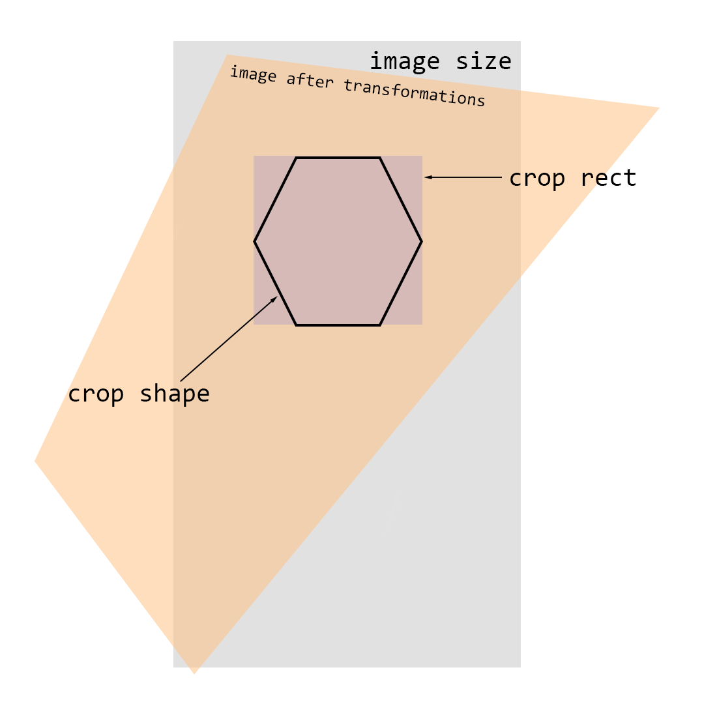
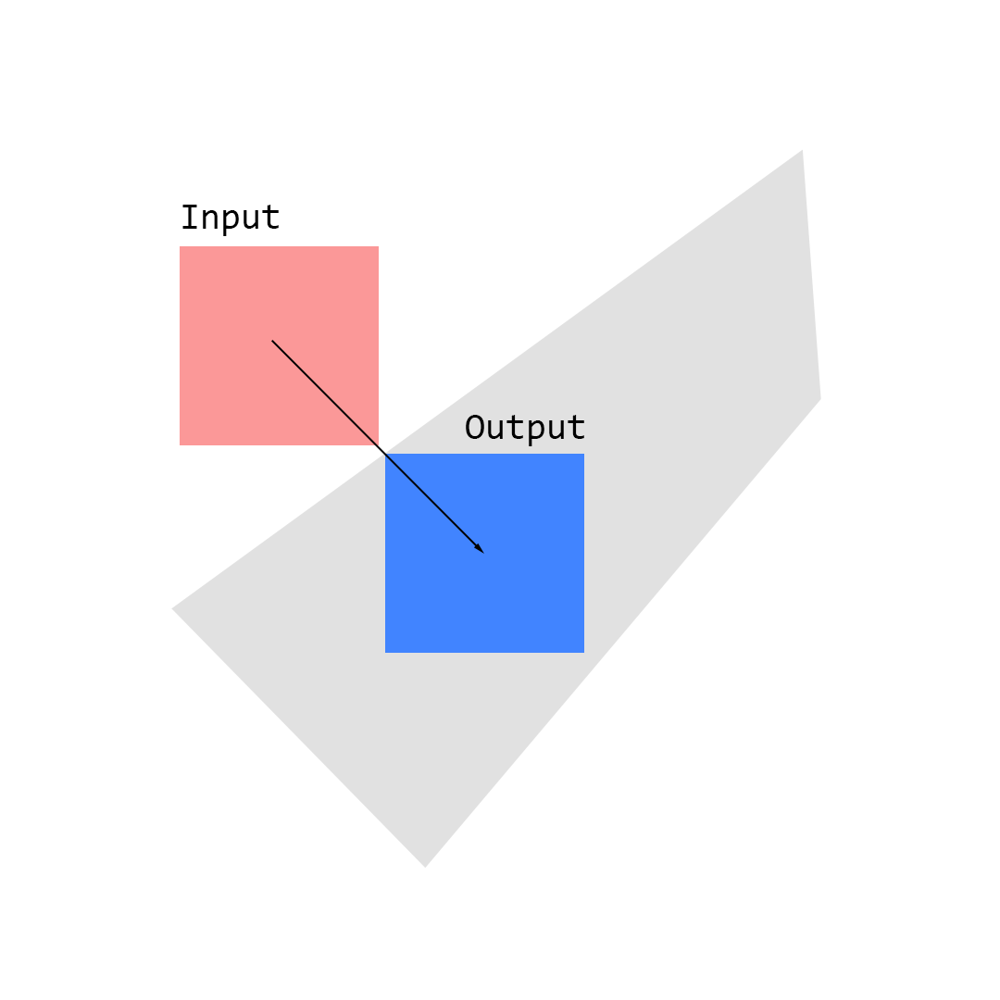
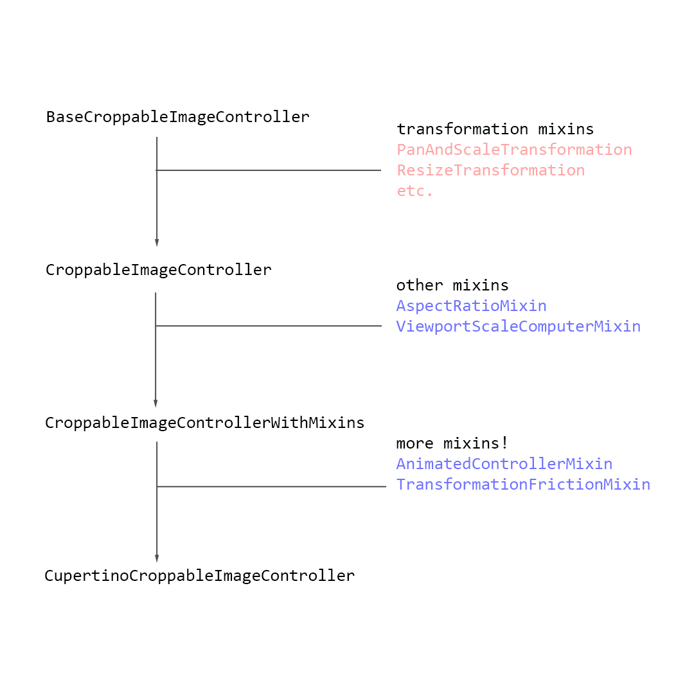
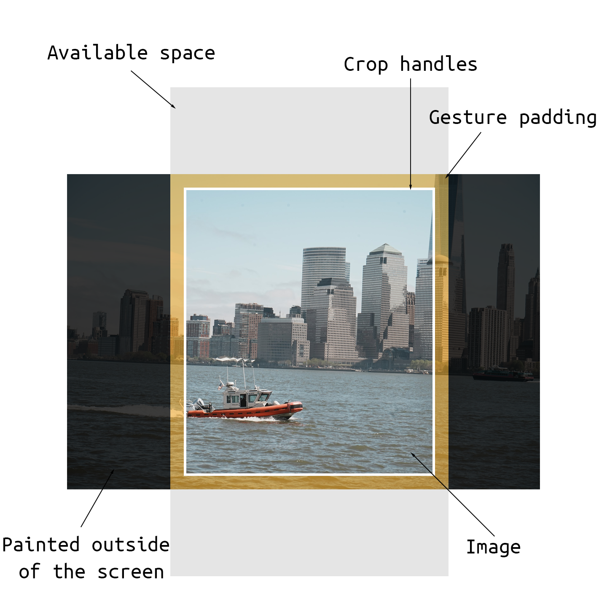
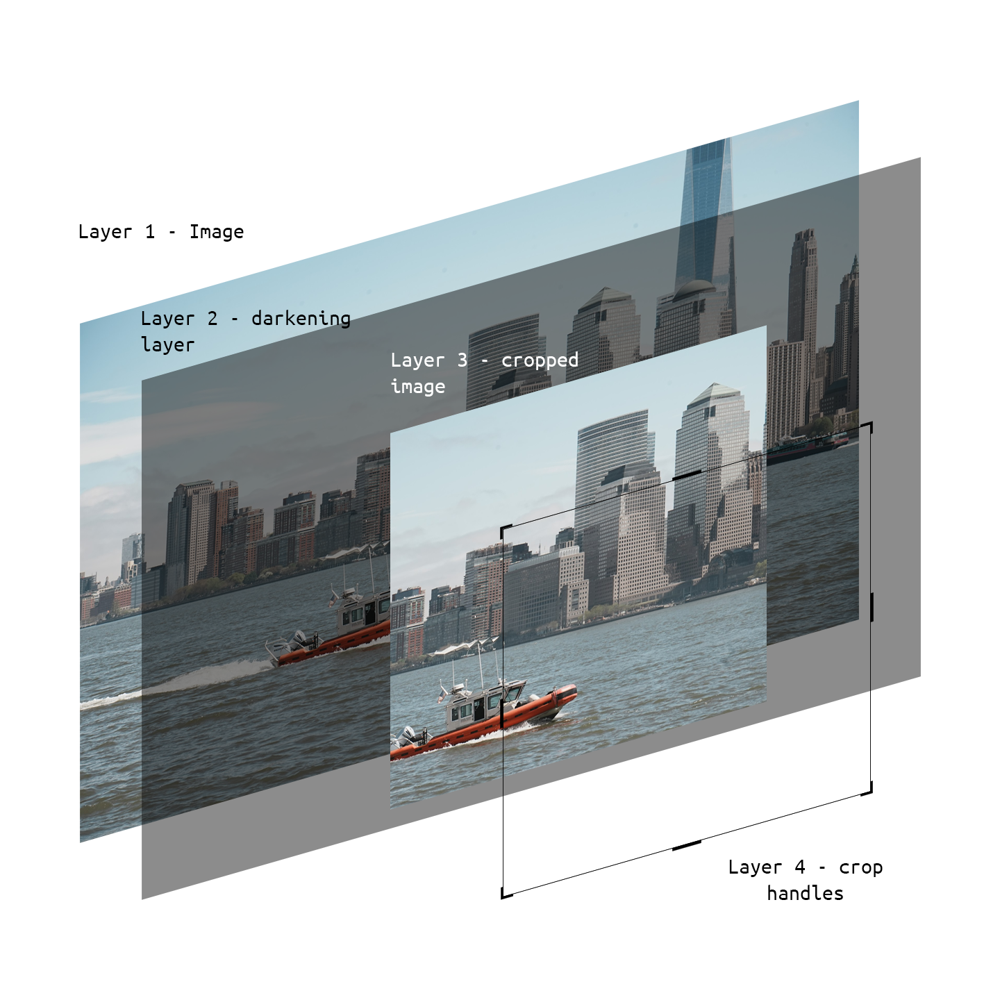

# croppy

Here's the mostly up-to-date documentation for `croppy`. It's a work in progress, so please bear with me. If you have any questions, feel free to ask them in GitHub Issues.

If you're searching for a way to save the resulting `ui.Image` to a file, take a look at the [saving images](./saving-images.md) guide.

- [croppy](#croppy)
  - [Getting started](#getting-started)
- [Data representation](#data-representation)
    - [Image data](#image-data)
    - [Crop](#crop)
    - [Transformations](#transformations)
    - [Normalization](#normalization)
- [Linear programming for normalizing the crop data](#linear-programming-for-normalizing-the-crop-data)
- [Geometry](#geometry)
- [Cropping the image](#cropping-the-image)
- [Controller](#controller)
  - [Transformation mixins](#transformation-mixins)
    - [MirrorTransformation](#mirrortransformation)
    - [PanAndScaleTransformation](#panandscaletransformation)
    - [ResizeTransformation](#resizetransformation)
    - [RotateTransformation](#rotatetransformation)
    - [StraightenAndPerspectiveTransformation](#straightenandperspectivetransformation)
  - [Other mixins](#other-mixins)
  - [Default controllers](#default-controllers)
- [Presentation](#presentation)
  - [Viewport](#viewport)
  - [Croppable image](#croppable-image)
    - [Remark: Hero animations](#remark-hero-animations)
  - [Crop handles](#crop-handles)
  - [Creating your own custom cropper](#creating-your-own-custom-cropper)
  - [Launching a cropper](#launching-a-cropper)
- [Further reading](#further-reading)


## Getting started

Install `croppy` from `pub`:

```yaml
dependencies:
  croppy: <latest_version>
```

`croppy` ships with its own dynamically linked C++ library to handle solving linear programming problems using `kiwi`. It's a part of the package, so you don't need to do anything else. If there are any issues during the installation or build process, please report them on GitHub Issues.

To use `croppy`, you need to import it, and you can use one of the two built-in croppers (Cupertino or Material) or create your own custom cropper.

```dart
final result = await showMaterialImageCropper(
  context,
  imageProvider: const NetworkImage('MY_IMAGE_URL'), // Or any other image provider
);

final result = await showCupertinoImageCropper(
  context,
  imageProvider: const NetworkImage('MY_IMAGE_URL'), // Or any other image provider
);
```

They both accept the following arguments:

- `imageProvider` - an image provider that will be used to load the image. You can use any image provider, such as `NetworkImage`, `FileImage`, `MemoryImage`, etc.

- `CroppableImageData? initialData` - an optional argument that can be used to provide initial data for the crop editor. If not provided, the image will be loaded from the `imageProvider` and the crop editor will be initialized with the image's size.

- `CroppableImagePostProcessFn? postProcessFn` - an optional argument that can be used to provide a function that will be called after the user finishes cropping the image, but before the cropper is closed. This function can be used to perform any additional processing on the image, such as compressing it, etc. The function accepts `CropImageResult` as an argument (see below for more information).

- `CropShapeFn? cropPathFn` - an optional argument that can be used to provide a function that will be used as a custom crop path. The function accepts `Size` as an argument and should return a `CropShape` that will be used as a crop shape. By default, `aabbCropShapeFn` is used, which will crop the image with a rectangle. For ellipses or circles - there's `ellipseCropShapeFn`. See the `CropShape` method for more information.

- `List<CropAspectRatio?>? allowedAspectRatios` - an optional argument that can be used to provide a list of allowed aspect ratios. If not provided, the user will be able to crop the image with any aspect ratio. A `null` value in the list means that any aspect ratio is allowed. See the `CropAspectRatio` class for more information.

- `List<Transformation>? enabledTransformations` - an optional argument that can be used to provide a list of transformations that will be enabled in the cropper. If not provided, all transformations will be enabled. See the `Transformation` class for more information.

- `Object? heroTag` - an optional argument that can be used to provide a hero tag for the cropper. If provided, the cropper will be opened with a hero animation. See the documentation for information about the constraints of using hero animations with `croppy`.

- `bool shouldPopAfterCrop = true` - an optional argument that can be used to specify whether the cropper should be closed after the user finishes cropping the image. If set to `false`, the cropper will not be closed and you can handle the closing of the route yourself. This is useful if you want to perform some complex animations after the user finishes cropping the image.

The return value of `showCupertinoImageCropper` is `CropImageResult`, which contains the `dart:ui.Image` of the cropped image and the `CroppableImageData` that was used to crop the image. The `CroppableImageData` can be used to crop the image again with the same transformations.

For a complete runnable example, see `./example`.

# Data representation

The problem that I faced during development is how I can represent the transformations and the crop shape in a way that is easy to understand and to work with. The main goal of this project was to support any kind of an affine image transformation, and any kind of an image shape, and I think the result looks pretty good.

The main data structure that is used to represent the transformations and the crop shape is `CroppableImageData`. To quickly run down through its fields:



### Image data
- `Size imageSize` - the original size of the image that is going to get cropped.
  
### Crop
- `Rect cropRect` - the crop rectangle that is going to be used to crop the image. Note that this rectangle is always axis-aligned, and represents the bounding box of the arbitrary crop shape. The resulting image's size is going to be the same as the size of this rectangle.
- `CropShape cropShape` - the shape of the area that is going to be cropped. 

`CropShape` defines the shape of the area that is going to be cropped. I've decided to separate it into three possible variants:
- Rectangle (AABB)
- Ellipse
- Arbitrary shape

In case of a rectangle, the calculations are much simpler. For an ellipse, there's a possible optimization that can be applied to the calculations. For an arbitrary shape, the calculations are the most complex, and the most expensive.

`CropShape` contains the following fields:
- `CropShapeType type` - the type of the shape. Can be `aabb`, `ellipse`, or `custom`.
- `dynamic path` - the path that is used to represent the shape. For an `aabb`, this contians `Aabb2`. For an `ellipse`, this contains `Ellipse2`. For a `custom` shape, this contains `vg.Path` (`vg` is the [vector graphics library](https://github.com/dnfield/vector_graphics)).
- `vg.Path vgPath` - the vector-graphics library path that is used to represent the shape. For an `aabb` or an `ellipse`, this is the shape converted to `vg.Path`. For a `custom` shape, this is equal to `path`.

The reason that this package is using `vector_graphics` instead of Dart's `Path` is that to properly do collision detection with custom shapes, we need to be able to "sample" the path at various points, but Dart's `Path` doesn't support that. `vector_graphics`'s Path does support that, so a slightly modified copy of the source code was included in this package.
  
### Transformations
- `BaseTransformations baseTransformations` - an object that contains the "base" transformations applied to the image after any other transformations. 
- `Matrix4 imageTransform` - the transformation matrix that is applied to the image. This contains transformations like rotation, translation, etc.
- `Matrix4 currentImageTransform` - the currently 'in-progress' transformation matrix. This is used, for example, when there's an ongoing transformation (such as rotation), and the transformation itself may get cancelled by the user. This matrix is used to store the current transformation state, and to restore the original state if the transformation gets cancelled.

A list of base transformations:
- `double rotationX`, `double rotationY`, `double rotationZ` - the rotation applied to the image. This is used to rotate the image around the center of the image. The reason why this is kept as three separate fields is that firstly, it's easier to work with them in that way.
- `double scaleX`, `double scaleY` - the scale applied to the image. This is used to scale the image around the center of the image. For example, setting `scaleX` to `-1` will flip the image horizontally.

### Normalization

A croppable image data can be either "normalized" or "non-normalized" (i.e. valid and non-valid). A normalized croppable image data is an image data that has the crop shape completely inside of the image bounds. A non-normalized croppable image data is an image data that has the crop shape outside of the image bounds. In some cases, the image data can be non-normalized (e.g. when the Cupertino controller is being used that allows the crop shape to be temporarily outside of the image bounds). When this happens, `CroppableImageData.isNormalized` will return `false`, and the "Save" button should not be enabled.


# Linear programming for normalizing the crop data

Using these fields, it's possible to represent (almost) any kind of an affine transformation. Now, if you think about it geometrically, the shape of an image will always be a quadrilateral, and the shape of the crop will be an arbitrary polygon (for shapes with Bezier curves we approximate them with line segments).

One big problem that I faced is the problem of collision detection and "fitting" the crop polygon in an image quad to "normalize" the croppable data. This is required to "mimic" the behavior of the Photos app in iOS - if you play around with it, you can notice that after you drag the crop rect out of the image bounds, it will find a closest position where it can fit the crop rect, and animate it there. This is a very important feature, and it's required to make the cropper feel "natural". This is also used in the Material cropper, but there the calculations take place without animation, and the crop rect is not allowed to be non-normalized.

Initially, I tried to solve this using a bunch of linear algebra and vector trickery, however, it turned out to be a very complex problem, and I couldn't find a solution.

After a while, [my friend](https://github.com/daniyarzt) helped me out with creating a LP-based solution. The idea is that we can represent the crop area as a convex polygon, and the image quad is, well, a quad. We are allowed to "scale" the polygon (but preserve its aspect ratio), so we first solve to try to maximize the size (but not bigger than the original size). After we find an appropriate size, we try to find a closest position where the polygon can fit inside the quad. To accomplish this, there's a C++ solver based on `kiwi`, and a Dart solver based on `cassowary` (which is a port of `kiwi`).



There are two LP problems that are solved:
- `fitPolygonInQuad` - fits a polygon inside of a quad. This is used to find a closest position where the crop rect can fit inside of the image bounds.
- `fitPolygonInQuadOnResize` - fits a polygon inside of a quad during a resize transformation. The difference is that some points can be set as "static", i.e. not allowed to move.

The Dart solver is in `lp/fit_polygon_in_quad_dart.dart` file, and the C++ solver is in the top-level `src` folder. The C++ solver is called using `dart:ffi`.

If, for some reason, the Dart solver is preferred to be used instead of the C++ solver, then the `croppyForceUseCassowaryDartImpl` global variable can be set to `true`. This is not recommended, as the Dart solver is much slower than the C++ solver. However, for some reason in Debug mode the performance of the C++ solver is much worse than in Release mode, so it's recommended to use the Dart solver in Debug mode. And, of course, the C++ solver is not supported on Web.

# Geometry

`croppy` uses the `vector_math` library to use for, well, vector math, and it also defines a lot of useful geometric shapes in the `geometry` folder.

# Cropping the image

To crop the image, `croppy` defines two methods:

- `crop_image.dart` - uses `dart:ui` to crop the image. This is the fastest method, and supports all kinds of transformations, and is the most accurate. However, due to some reason it's not supported on Web.
- `web_crop_image.dart` - uses `package:image` to create a blank image, and crops the image pixel-by-pixel, entirely on the CPU. This is slow, bugs out with perspective transformations, and uses bilinear interpolation, but it's the only method that works on Web. This will be improved in the future.

# Controller

Usually you wouldn't interact with `CroppableImageData` directly. Instead, it's recommended to use `CroppableImageController` to interact with the data. A controller handles things like "normalizing" the croppable image after a transformation is done, the "scale" of the viewport area, etc.

To do that, a controller defines a lot of different "transformations" that can be applied to the image. These are defined as mixins so that the code of the controller doesn't get too bloated.

Other things like handling aspect ratios, animations, "static layout" during resize, friction, etc. are also handled by the controller and are defined as separate mixins.



The mixins define various functions using which you can interact with the controller. For example, transformation mixins define following methods:

- `onXStart()` - called when a transformation starts
- `onX()` - called when a transformation is in progress
- `onXEnd()` - called when a transformation ends

The gesture recognizers or other widgets can call these methods to interact with the controller. For example, the `ResizeTransformation` defines 
`onResizeStart()`, `onResize()`, and `onResizeEnd()` methods. It is important
to make sure that if `onResizeStart()` is called, then `onResizeEnd()` will also
be called. This is because the controller may be in a "temporary" state, and
`onResizeEnd()` will be used to "flush" the `currentImageTransform` to the
`imageTransform`.

## Transformation mixins

Here's the list of all transformations available:

### MirrorTransformation
- `onMirrorHorizontal()` - mirrors the image horizontally

### PanAndScaleTransformation

This transformation is used to pan and scale the image by dragging it with one or two fingers.

- `onPanAndScaleStart()`, `onPanAndScale()`
- `void onPanAndScale(double scaleDelta, Offset offsetDelta)` - called when a pan and scale transformation is in progress. 

### ResizeTransformation

This transformation is used to resize the crop by dragging it from a corner.

- `onResizeStart()`, `onResizeEnd()`
- `void onResize(Offset offsetDelta, ResizeDirection direction)` - called when a resize transformation is in progress. `direction` is the direction in which the image is being resized, i.e. the corner that is being dragged.

### RotateTransformation

This transformation is used to apply a base image rotation (i.e. CW/CCW rotations).

- `void onRotateCCW()` - rotates the image counter-clockwise by 90 degrees.

### StraightenAndPerspectiveTransformation

This transformation is used to straighten or apply a perspective transformation to the image.

- `onStragithenStart()`, `onStraightenEnd()`
- `void onStraighten(double angleRad)` - called when a straighten transformation is in progress. Rotates the image around Z axis.

- `onRotateYStart()`, `onRotateYEnd()`
- `void onRotateY(double angleRad)` - called when a perspective transformation is in progress. Rotates the image around Y axis. Applies a base transformation.

- `onRotateXStart()`, `onRotateXEnd()`
- `void onRotateX(double angleRad)` - called when a perspective transformation is in progress. Rotates the image around X axis. Applies a base transformation.

## Other mixins

Apart from transformations, there are mixins for other things:

- `AnimatedControllerMixin` - handles animations. Creates tweens, controllers, etc.
- `AspectRatioMixin` - handles aspect ratios. This can be used to set a fixed aspect ratio for the crop area.
- `ResizeStaticLayoutMixin` - handles static layout during resize. This is used to mimic the behavior of the Photos app in iOS, where the image remains static during a resize transformation. Without this, when the crop area changes, the image will also change its position (because the crop area is always centered), which is somewhat confusing.
- `TransformationFrictionMixin` - handles friction. This is similar to `BouncingScrollPhysics`, where going out-of-bounds will cause the image to "bounce" back. This is used to make the cropper feel more natural.
- `ViewportScaleComputerMixin` - computes the scale of the viewport when displaying the crop area on the screen.

## Default controllers

`croppy` ships with two default controllers:
- `CupertinoCroppableImageController` - mimics the behavior of the Photos app in iOS.
- `MaterialCroppableImageController` - mimics the behavior of the Google Photos app.

It's recommended to use these controllers instead of creating your own, as they are already configured and should be enough for most use cases. If there's anything missing or you want to change something, you can always create your own controller. I would recommend to use the default controllers as a reference, as there are a lot of small things that need to be handled (e.g. some transformations should finish with animations, some should instantly snap, etc.)

# Presentation

## Viewport

The following is an illustration of how a normal cropper page looks like:



The crop area is always centered on the screen, and the image can be painted outside of the bounds. By default, it's unclipped.

The gesture padding is applied to make sure that the user can easily interact with the corners of the crop area to resize it.

The `CroppableImageViewport` widget is responsible for laying out the page in this manner. It also handles telling the controller the available size of the viewport (so that the scale of the image can be computed properly).

## Croppable image

To display the croppable image itself, the `CroppableImageWidget` is used. It's a somewhat complicated RenderObject that manages painting the image, the crop handles, and the "dark" tint.



### Remark: Hero animations

One cool feature of `croppy` is that it works with Hero animations out of the box. This means that if you have an image that is displayed somewhere in your app, and you want to open the cropper with that image, you can do that with a Hero animation, therefore making the experience seem more natural to the end user.

To achieve this, the `CroppableImageViewport` can also optionally build a `Hero` widget. The child of this `Hero` is the cropped image itself, which is displayed behind the `CroppableImageWidget`. However, there's a need to "coordinate" the animation - if the `CroppableImageWidget` is always visible, then the `Hero` animation wouldn't work as the cropped image is already visible via `CroppableImageWidget`. To solve this, the `CroppableImagePageAnimator` widget is used. It's a widget that can animate the "overlays" - meaning that when the page is first opened, the `CroppableImageWidget` is hidden, and once the Hero animation settles, the `CroppableImageWidget` is slowly faded in.

## Crop handles

Crop handles display the crop area, and can also display "corners" by which the user can resize the crop area. `croppy` provides two built-in crop handles:

- `CupertinoImageCropHandles` - mimics the behavior of the Photos app in iOS.
- `MaterialImageCropHandles` - mimics the behavior of the Google Photos app.

The colors of the default crop handles can be customized by passing arguments to their constructors.

These were designed to match the behavior of their respective apps as closely as possible. However, if you want to customize the behavior, you can always create your own crop handles - it's all just widgets :)

## Creating your own custom cropper

Here's the fun part - creating your own custom cropper! This is actually quite easy, as you can just use the `CroppableImageViewport` and `CroppableImageWidget` widgets, and then customize the rest to your liking.

Here's an example of a minimal custom cropper:

```dart
class CustomCropper extends StatelessWidget {
  const CustomCropper({
    super.key,
    required this.imageProvider,
    required this.initialData,
    this.heroTag,
    this.onCropped,
  });

  final ImageProvider imageProvider;
  final CroppableImageData? initialData;
  final Object? heroTag;
  final Future<CropImageResult> Function(CropImageResult)? onCropped;

  @override
  Widget build(BuildContext context) {
    // Creates a croppable image controller
    return DefaultCupertinoCroppableImageController(
      imageProvider: imageProvider,
      initialData: initialData,
      postProcessFn: onCropped,
      builder: (context, controller) {
        // Used to animate the page with Hero animations. Can be omitted if
        // you don't want to use Hero animations.
        return CroppableImagePageAnimator(
          controller: controller,
          heroTag: heroTag,
          builder: (context, overlayOpacityAnimation) {
            return Scaffold(
              appBar: AppBar(
                actions: [
                  // The "Done" button
                  Builder(
                    builder: (context) => TextButton(
                      child: const Text('Done'),
                      onPressed: () async {
                        // Enable the Hero animations
                        CroppableImagePageAnimator.of(context)
                            ?.setHeroesEnabled(true);

                        // Crop the image
                        final result = await controller.crop();

                        if (context.mounted) {
                          Navigator.of(context).pop(result);
                        }
                      },
                    ),
                  ),
                ],
              ),
              body: Center(
                child: Padding(
                  padding: const EdgeInsets.all(32.0),
                  // Viewport is used to lay out the croppable image
                  child: AnimatedCroppableImageViewport(
                    controller: controller,
                    // We're using the default Material crop handles, but you
                    // can use your own if you want to.
                    cropHandlesBuilder: (context) => MaterialImageCropperHandles(
                      controller: controller,
                      gesturePadding: 16.0,
                    ),
                    overlayOpacityAnimation: overlayOpacityAnimation,
                    gesturePadding: 16.0,
                    heroTag: heroTag,
                  ),
                ),
              ),
            );
          },
        );
      },
    );
  }
}
```

You can see the full example in the `example` folder.

## Launching a cropper

If you're using `Hero` animations, it's important to make sure that the controller's `initialData` field is non-null when the widget is first created. This is because we can't really display anything if the `initialData` is `null` - and creating an instance of `CroppableImageData` is asynchronous, because we need to load the image's size first. Thus, if it's passed as `null`, during the initial build nothing will be displayed, and the Hero animation will be broken.

To mitigate this, you can use the `CroppableImageData.fromImageProvider` constructor before you actually launch the cropper. This will load the image's size and return a `Future<CroppableImageData>`, which you can then pass to the cropper.

Example (from the `example/custom_cropper.dart`):

```dart
Future<CropImageResult?> showCustomCropper(
  BuildContext context,
  ImageProvider imageProvider, {
  CroppableImageData? initialData,
  Object? heroTag,
  Future<CropImageResult> Function(CropImageResult)? onCropped,
}) async {
  // Before pushing the route, prepare the initial data. If it's null, populate
  // it with empty content. This is required for Hero animations.
  final _initialData = initialData ??
      await CroppableImageData.fromImageProvider(
        imageProvider,
      );

  if (context.mounted) {
    return Navigator.of(context).push(
      MaterialPageRoute(
        builder: (context) {
          return CustomCropper(
            imageProvider: imageProvider,
            initialData: _initialData,
            heroTag: heroTag,
            onCropped: onCropped,
          );
        },
      ),
    );
  }

  return null;
}
```

The default Material and Cupertino croppers already do this for you, so you don't have to worry about it.

# Further reading

This is it for the documentation. If you want to learn more, you can check out the example app, which contains some more advanced usage examples. If you have any questions or suggestions, feel free to open an issue or a pull request.